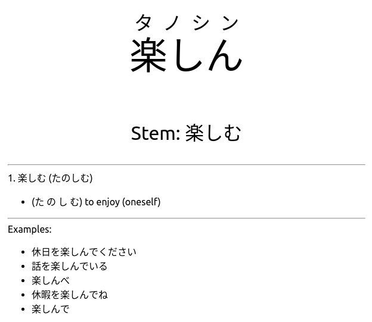

References:
- https://github.com/polm/fugashi#installing-a-dictionary
- https://github.com/kerrickstaley/genanki
- https://github.com/PokiDokika/jisho-py

Subtitle Sites:
- https://kitsunekko.net

# How it works
### Anki Flash Card Example



Download a japanese subtitle file. This tool will parse that file and give you the n most common japanese words used. It will then export those words and translations to an Anki flash card deck for spaced repetition studying.

# Dependencies
- fugashi - package for japanese language tokenization (I'm using it to break the corpus in to separate words)
- jisho-py - package creates a python api to jisho.org japanese dictionary and returns results with japanese kanji & kana as well as english translations
Note: jisho-py currently must be copied to the site-packages directory because it's pip installation is broken. Just import a package like import numpy as np, then `print(np.__file__)` to get the site-packages location
- genanki - package for generating anki decks

# Usage
Export anki deck with 10 most common words and kana included in question
```
python subjapflash.py -s Subtitles/Naruto_Shippuuden_393.srt
```
Export anki deck with 20 most common words and no kana
```
python subjapflash.py -s Subtitles/Naruto_Shippuuden_393.srt --top 20 --kana False 
```
Save with different deck name
```
python subjapflash.py -s Subtitles/Naruto_Shippuuden_393.srt --deck_name My_Custom_Deck
```

Notes
- All words will automatically be added to the ignore list under the `IGNORE_LIST/previous_export_words.txt` unless the `--ignore_added True` argument is used.
- The anki deck's card answer will be limited to how many lines are added with the `--max_lines` arg (default 10). The code will continue to iterate words and definitions on jisho.org until the max line count is reached.